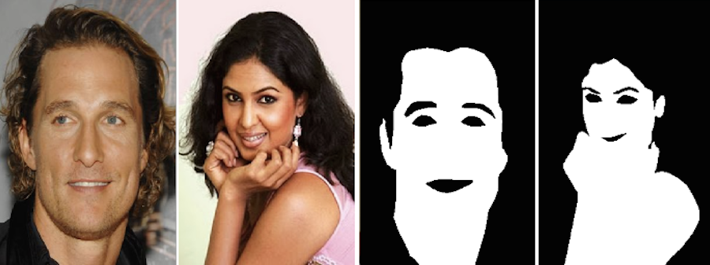
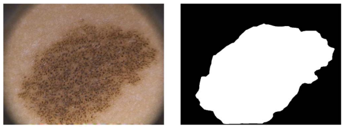
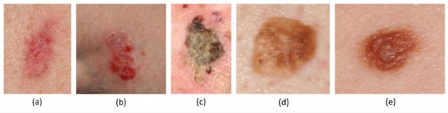

# DermSynth3D
[](https://dl.circleci.com/status-badge/redirect/gh/sfu-mial/DermSynth3D/tree/main) 

[](#) 
[](#) 
[](https://github.com/psf/black)
 

This is the official code repository following our work [DermSynth3D](#link-to-arxiv).

## TL;DR

A data generation pipeline for creating photorealistic _in-the-wild_  synthetic dermatalogical data with rich annotations such as semantic segmentation masks, depth maps, and bounding boxes for various skin analysis tasks.

 
_The figure shows the DermSynth3D computational pipeline where 2D segmented skin conditions are blended into the texture image of a 3D mesh on locations outside of the hair and clothing regions. After blending, 2D views of the mesh are rendered with a variety of camera viewpoints and lighting conditions and combined with background images to create a synthetic dermatology dataset._

## Motivation

In recent years, deep learning (DL) has shown great potential in the field of dermatological image analysis.
However, existing datasets in this domain have significant limitations, including a small number of image samples, limited disease conditions, insufficient annotations, and non-standardized image acquisitions.
To address these shortcomings, we propose a novel framework called ${DermSynth3D}$.

${DermSynth3D}$ blends skin disease patterns onto 3D textured meshes of human subjects using a differentiable renderer and generates 2D images from various camera viewpoints under chosen lighting conditions in diverse background scenes.
Our method adheres to top-down rules that constrain the blending and rendering process to create 2D images with skin conditions that mimic *in-the-wild* acquisitions, resulting in more meaningful results.
The framework generates photo-realistic 2D dermoscopy images and the corresponding dense annotations for semantic segmentation of the skin, skin conditions, body parts, bounding boxes around lesions, depth maps, and other 3D scene parameters, such as camera position and lighting conditions.
${DermSynth3D}$ allows for the creation of custom datasets for various dermatology tasks.

<!-- Existing datasets for dermatological image analysis have significant limitations, including a small number of image samples, limited disease conditions, insufficient annotations, and non-standardized image acquisitions.
To address this problem, we propose **DermSynth3D**, or generating synthetic 2D skin image datasets using 3D human body meshes blended with skin disorders from clinical images.
Our approach uses a differentiable renderer to blend the skin lesions within the texture image of the 3D human body and generates 2D views along with corresponding annotations, including semantic segmentation masks for skin conditions, healthy skin, non-skin regions, and anatomical regions. 
Moreover, we include a diverse range of skin tones and background scenes, that enables us to generate semantically rich and meaningful labels for 2D _in-the-wild_ clinical images that can be used for a variety of dermatological tasks, as opposed to just one. -->

<!-- We present a novel framework called **DermSynth3D** that blends skin disease patterns onto 3D textured meshes of human subjects using a differentiable renderer and generates 2D images from various camera viewpoints under chosen lighting conditions in diverse background scenes. -->

<!-- The 2D dermatological images generated using DermSynth3D are:
- meaningful _i.e._ anatomically relevant
- mimic _in-the-wild_ acquistions
- photo-realistic
- densely annotated with
  - Semantic segmentation labels of healthy skin, skin-condition, and human anatomy
  - Bounding boxes around skin-condition
  - Depth maps
  - 3D scene parameters, such as camera position and lightning conditions -->

## Repository layout

```bash
DermSynth3D/
┣ assets/                      # assets for the README
┣ configs/                     # YAML config files to run the pipeline
┣ logs/                        # experiment logs are saved here (auto created)
┣ out/                         # the checkpoints are saved here (auto created)
┣ data/                        # directory to store the data
┃  ┣ ...                       # detailed instructions in the dataset.md
┣ dermsynth3d/                 # 
┃  ┣ datasets/                 # class definitions for the datasets
┃  ┣ deepblend/                # code for deep blending
┃  ┣ losses/                   # loss functions 
┃  ┣ models/                   # model definitions
┃  ┣ tools/                    # wrappers for synthetic data generation
┃  ┗ utils/                    # helper functions
┣ notebooks/                   # demo notebooks for the pipeline
┣ scripts/                     # scripts for traning and evaluation
┗ skin3d/                      # external module
```
- [DermSynth3D](#dermsynth3d)
  - [TL;DR](#tldr)
  - [Motivation](#motivation)
  - [Repository layout](#repository-layout)
  - [Table of contents](#table-of-contents)
    - [Installation](#installation)
      - [using conda](#using-conda)
      - [using Docker](#using-docker)
      - [NOTE](#note)
  - [Datasets](#datasets)
    - [The folder structure of data directory should be as follows:](#the-folder-structure-of-data-directory-should-be-as-follows)
    - [Data for Blending](#data-for-blending)
    - [Data For Training](#data-for-training)
  - [How to Use $DermSynth3D$](#how-to-use-dermsynth3d)
    - [Generating Synthetic Dataset](#generating-synthetic-dataset)
      - [Post-Process Renderings with Unity](#post-process-renderings-with-unity)
    - [Preparing Dataset for Experiments](#preparing-dataset-for-experiments)
  - [Cite](#cite)
  - [Demo Notebooks for Dermatology Tasks](#demo-notebooks-for-dermatology-tasks)
    - [Lesion Segmentation](#lesion-segmentation)
    - [Multi-Task Prediction](#multi-task-prediction)
    - [Lesion Detection](#lesion-detection)
  - [Acknowledgements](#acknowledgements)


## Table of contents
- [Installation](#installation)
  - [using conda](#using-conda)
  - [using Docker](#using-docker) **recommended**
- [Datasets](#datasets)
- [Usage](#usage)
  - [Generating Synthetic Dataset](#generating-synthetic-dataset)
  - [Preparing Dataset for Experiments](#preparing-dataset-for-experiments)
- [Cite](#cite)
- [Demo Notebooks for Dermatology Tasks](#demo-notebooks-for-dermatology-tasks)
  - [Lesion Segmentation](#lesion-segmentation)
  - [Multi-Task Prediction](#multi-task-prediction)
  - [Lesion Detection](#lesion-detection)

<a name="installation"></a>

### Installation

<a name="conda"></a>

#### using conda

```bash
git clone --recurse-submodules https://github.com/sfu-mial/DermSynth3D.git 
cd DermSynth3D
conda create --name dermsynth3d -f dermsynth3d.yml
conda activate dermsynth3d
```

<a name="docker"></a>

#### using Docker

```bash
# Build the container in the root dir
docker build -t dermsynth3d --build-arg UID=$(id -u) --build-arg GID=$(id -g) -f Dockerfile .
# Run the container in interactive mode for using DermSynth3D
# See 3. Usage
docker run --gpus all -it --rm -v /path/to/downloaded/data:/data dermsynth3d
```
We provide the [pre-built docker image](https://hub.docker.com/r/sinashish/dermsynth3d), which can be be used as well:
```bash
# pull the docker image
docker pull sinashish/dermsynth3d:latest
# Run the container in interactive GPU mode for generating data and training models
# mount the data directory to the container
docker run --gpus all -it --rm -v /path/to/downloaded/data:/data dermsynth3d
```

#### <span style="color: red">NOTE</span>

The code has been tested on Ubuntu 20.04 with CUDA 11.1, python 3.8, pytorch 1.10.0, and pytorch3d 0.7.2, and we don't know if it will work on CPU.

If you face any issues installing pytorch3d, please refer to their [installation guide](https://github.com/facebookresearch/pytorch3d/blob/main/INSTALL.md) or this issue [link](https://github.com/facebookresearch/pytorch3d/issues/1076).


<a name="data"></a>

## Datasets

Follow the instructions below to download the datasets for generating the synthetic data and training models for various tasks.
All the datasets should be downloaded and placed in the `data` directory. 

<a name="tree"></a>

<!-- #### The folder structure of data directory should be as follows: -->
<details>

  <summary> 

  ### The folder structure of data directory should be as follows: 

  </summary>

```bash
DermSynth3D/
┣ ...						   		# other source code
┣ data/                        		# directory to store the data
┃  ┣ 3dbodytex-1.1-highres   		# data for 3DBodyTex.v1 3d models and texture maps
┃  ┣ fitzpatrick17k/
┃  ┃  ┣ data/               		# Fitzpatrick17k images
┃  ┃  ┗ annotations/        		# annotations for Fitzpatrick17k lesions
┃  ┣ ph2/                   
┃  ┃  ┣ images/               		# PH2 images
┃  ┃  ┗ labels/               		# PH2 annotations
┃  ┣ dermofit/ 						# Dermofit dataset
┃  ┃  ┣ images/               		# Dermofit images	
┃  ┃  ┗ targets/               		# Dermofit annotations 
┃  ┣ FUSeg/
┃  ┃  ┣ train/               		# training set with images/labels for FUSeg
┃  ┃  ┣ validation/               	# val set with images/labels for FUSeg
┃  ┃  ┗ test/               		# test set with images/labels for FUSeg
┃  ┣ Pratheepan_Dataset/
┃  ┃  ┣ FacePhoto/               	# images from Pratheepan dataset
┃  ┃  ┗ GroundT_FacePhoto/  	 	# annotations
┃  ┣ lesions/                   	# keep the non-skin masks for 3DBodyTex.v1 meshes here
┃  ┣ annotations/                   # segmentation masks for Annotated Fitzpatrick17k lesions
┃  ┣ bodytex_anatomy_labels/ 		# per-vertex labels for anatomy of 3DBodyTex.v1 meshes
┃  ┣ background/               		# keep the background scenes for rendering here
┃  ┗ synth_data/			   		# the generated synthetic data will be stored here
    	┣ train/               		# training set with images/labels for training on synthetic data
	    ┣ <val/test>/ 			 	# val and test set with images/labels for training on synthetic data
```

</details>

The datasets used in this work can be broadly categorized into data required for blending and data necessary for evaluation.

<details> 
  <summary>

  ### Data for Blending

  </summary>
  <!-- list of blending datasets -->
  <details> 
  <summary>

  - ### Download 3DBodyTex.v1 meshes

  </summary>

  </img> 
  <!--  -->
  The `3DBodyTex.v1` dataset can be downloaded from [here](https://cvi2.uni.lu/datasets/).

  `3DBodyTex.v1` contains the meshes and texture images used in this work and can be downloaded from the external site linked above (after accepting a license agreement). 

  **NOTE**: These textured meshes are needed to run the code to generate the data.

  We provide the non-skin texture maps annotations for 2 meshes: `006-f-run` and `221-m-u`.  
  Hence, to generate the data, make sure to get the `.obj` files for these two meshes and place them in `data/3dbodytex-1.1-highres` before excecuting `scripts/gen_data.py`.

  After accepting the licence, download and unzip the data in `./data/`.

  </details>

  <details>

  <summary>
  
  - ### Download the 3DBodyTex.v1 annotations

  </summary>

  | _Non-skin texture maps_ | _Anatomy labels_ |
  |:-:|:-:|
  |<p align=left> We provide the non-skin texture map ($T_{nonskin}$) annotations for 215 meshes from the `3DBodyTex.v1` dataset [here](https://vault.sfu.ca/index.php/s/s8Sy7JdA74r1GN9). </p> | <p align=left> We provide the per-vertex labels for anatomical parts of the 3DBodyTex.v1 meshes obtained by fitting SCAPE template body model [here](https://vault.sfu.ca/index.php/s/TLLqxCs7MVhS117). </p>|
  |||

  The folders are organised with the same IDs as the meshes in `3DBodyTex.v1` dataset.

  </details>

  <details>
  <summary>

  - ### Download the Fitzpatrick17k dataset

  </summary>

  | _Fitzpatrick17k Images_| _Fitzpatrick17k annotations_|
  |:-:|:-:|
  | | |
  |<p align=left> We used the skin conditions from [Fitzpatrick17k](https://github.com/mattgroh/fitzpatrick17k). See their instructions to get access to the Fitzpatrick17k images. <br>We provide the raw images for the Fitzpatrick17k dataset [here](https://vault.sfu.ca/index.php/s/cMuxZNzk6UUHNmX).<br>After downloading the dataset, unzip the dataset:<br>```unzip fitzpatrick17k.zip -d data/fitzpatrick17k/```</p>| <p align=left> We provide the densely annotated lesion masks from the Fitzpatrick17k dataset are given within this repository under the `data` directory. More of such annotations can be downloaded from [here](https://vault.sfu.ca/index.php/s/gemdbCeoZXoCqlS).</p>| <p align=left>We provide the densely annotated lesion masks from the Fitzpatrick17k dataset are given within this repository under the `data` directory. More of such annotations can be downloaded from [here](https://vault.sfu.ca/index.php/s/gemdbCeoZXoCqlS). </p>|

  </details>

  <details>
  <summary>

  - ### Download the Background Scenes

  </summary>

  |||
  |:-:|:-:|
  |||

  Although you can use any scenes as background for generating the random views of the lesioned-meshes, we used [SceneNet RGB-D](https://robotvault.bitbucket.io/scenenet-rgbd.html) for the background IndoorScenes. Specifically, we used [this split](https://www.doc.ic.ac.uk/~bjm113/scenenet_data/train_split/train_0.tar.gz), and sampled 3000 images from it.

  For convenience, the background scenes we used to generate the ssynthetic dataset can be downloaded from [here](https://vault.sfu.ca/index.php/s/r7nc1QHKwgW2FDk).

  </details>

</details>

<details>
<summary>

### Data For Training 

</summary>
  <details>
  <summary>

  - ### Download the FUSeg dataset

  </summary>

  |||
  |:-:|:-:|
  |||

  The Foot Ulcer Segmentation Challenge (FUSeg) dataset is available to download from [their official repository](https://github.com/uwm-bigdata/wound-segmentation/tree/master/data/Foot%20Ulcer%20Segmentation%20Challenge). 
  Download and unpack the dataset at `data/FUSeg/`, maintaining the Folder Structure shown above.

  For simplicity, we mirror the FUSeg dataset [here](https://vault.sfu.ca/index.php/s/2mb8kZg8wOltptT).

  </details>

  <details>
  <summary>

  - ### Download the Pratheepan dataset

  </summary>

  

  The Pratheepan dataset is available to download from [their official website](https://web.fsktm.um.edu.my/~cschan/downloads_skin_dataset.html). 
  The images and the corresponding ground truth masks are available in a ZIP file hosted on Google Drive. Download and unpack the dataset at `data/Pratheepan_Dataset/`.

  </details>

  <details>
  <summary>
  
  - ### Download the PH2 dataset

  </summary>

  

  The PH2 dataset can be downloaded from [the official ADDI Project website](https://www.fc.up.pt/addi/ph2%20database.html). 
  Download and unpack the dataset at `data/ph2/`, maintaining the Folder Structure shown below.

  </details>

  <details>
  <summary>

  - ### Download the DermoFit dataset

  </summary>

  

  _An example image from the DermoFit dataset showing different skin lesions._

  The DermoFit dataset is available through a paid perpetual academic license from the University of Edinburgh. Please access the dataset following the instructions for [the DermoFit Image Library](https://licensing.edinburgh-innovations.ed.ac.uk/product/dermofit-image-library) and unpack it at `data/dermofit/`, maintaining the Folder Structure shown above.

  </details>

  <details>
  <summary>

  - ### Creating the Synthetic dataset

  </summary>
    
  
    _A few examples of annotated data synthesized using DermSynth3D. The rows from top to bottom show respectively: the rendered images with blended skin conditions, bounding boxes around the lesions, GT semantic segmentation masks, grouped anatomical labels, and the monocular depth maps produced by the renderer._
  For convenience, we provide the generated synthetic data we used in this work for various downstream tasks [here](https://vault.sfu.ca/index.php/s/mF2NVawbvvbW9lU).

  If you want to train your models on a different split of the synthetic data, you can download a dataset generated by blending lesions on 26 3DBodyTex scans from [here](https://vault.sfu.ca/index.php/s/rBTjTRaxTLrnqiE).
  To prepare the synthetic dataset for training. Sample the `images`, and `targets` from the path where you saved this dataset and then organise them into `train/val`.

  Alternatively, you can use the provided script `scripts/prep_data.py` to create it.

  Even better, you can generate your own dataset, by following the instructions [here](./README.md#generating-synthetic-dataset).

  </details>

</details>

<a name="usage"></a>

## How to Use DermSynth3D

<a name='gen'></a>

### Generating Synthetic Dataset


Before running any code, make sure that you have downloaded the data necessary for blending as mentioned in [datasets](#datasets) and folder structure is as described above.
If the folder structure is different, then please update the paths accordingly in `configs/blend.yaml`.

Now, to generate the synthetic data with the default parameters, simply run the following command to generate 2000 views for a specified mesh:

```bash
python -u scripts/gen_data.py
```

To change any blending or synthesis parameters only, run using:
```bash
python -u scripts/gen_data.py --lr <learning rate> \ 
            -m <mesh_name> \
            -s <path to save the views> \
            -ps <skin threshold> \
            -i <blending iterations> \
            -v <number of views> \
            -n <number of lesions per mesh> 
```
Feel free to play around with `random` parameter in `configs/blend.yaml` to control lighting, material and view points.

#### Post-Process Renderings with Unity

Follow the detailed instructions outlined [here](./docs/unity.md) to create photorealistic renderings using Unity.

<a name='prep'></a>

### Preparing Dataset for Experiments

After creating the syntheic dataset in the previous step, it is now the time to test the utility of the dataset on some real world tasks.

Before, you start with any experiments, ideally you would want to organize the generated data into `train/val/test` sets. 
We provide a script to do the same:
```bash
python scripts/prep_data.py
```

You can look at `scripts/prep_data.py` for more details.

<a name="cite"></a>

## Cite
If you find this work useful or use any part of the code in this repo, please cite our paper:
```bibtext
@unpublished{kawahara2023ds3d,
  title={DermSynth3D: Synthesis of in-the-wild annotated dermatology images},
  author={Kawahara, Jeremy\textsuperscript{*}\textsuperscript{1} and Sinha, Ashish\textsuperscript{*}\textsuperscript{1} and Pakzad, Arezou\textsuperscript{1} and Abhishek, Kumar and Ruthven, Matthieu and Baratab, Enjie and Kacem, Anis and Aouada, Djamila and Hamarneh, Ghassan},
  year={2023},
  note={Preprint. Currently under review.},
}
```

<a name="repro"></a>

## Demo Notebooks for Dermatology Tasks


<a name='seg'></a>
<a name='train'></a>

### Lesion Segmentation
**Note**: Update the paths to relevant datasets in `configs/train_mix.yaml`.

To train a lesion segmentation model with default parameters, on a combination of Synthetic and Real Data, simply run:

```bash
python -u scripts/train_mix_seg.py
```

Play around with the following parameters for a combinatorial mix of datasets.
```yaml
    real_ratio: 0.5                 # fraction of real images to be used from real dataset
    real_batch_ratio: 0.5           # fraction of real samples in each batch
    pretrain: True                  # use pretrained DeepLabV3 weights
    mode: 1.0                       # Fraction of the number of synthetic images to be used for training
```

You can also look at [this notebook](./notebooks/train_segmentation.ipynb) for a quick overview for training lesion segmention model.

For inference of pre-trained models/checkpoints, look at [this notebook](./notebooks/inference_segmentation.ipynb).

<a name='multi'></a>

### Multi-Task Prediction

We also train a multi-task model for predicting lesion, anatomy and depth, and evaluate it on multiple datasets.

For a quick overview of multi-task prediction task, checkout [this notebook](./notebooks/inference_multitask.ipynb).

For performing inference on your trained models for this task. First update the paths in `configs/multitask.yaml`. Then run:
```bash
python -u scripts/infer_multi_task.py
```

<a name='det'></a>

### Lesion Detection

For a quick overview for training lesion detection models, please have a look at [this notebook](./notebooks/train_detection.ipynb).

For doing a quick inference using the pre-trained detection models/ checkpoints, have a look at [this notebook](./notebooks/inference_detection.ipynb).

## Acknowledgements

We are thankful to the authors of [Skin3D](https://github.com/jeremykawahara/skin3d) for making their code and data public for the task of lesion detection on 3DBodyTex.v1 dataset.
