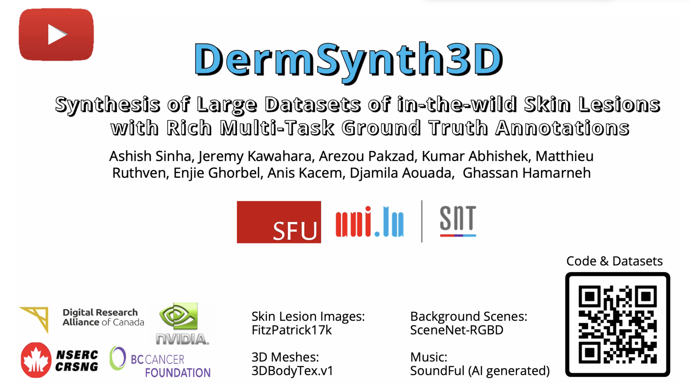
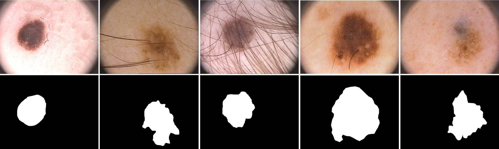

# DermSynth3D
<!-- [](https://dl.circleci.com/status-badge/redirect/gh/sfu-mial/DermSynth3D/tree/main) -->

[](https://arxiv.org/abs/2305.12621)
[](https://doi.org/10.48550/arXiv.2305.12621)
[](https://cvi2.uni.lu/3dbodytexdermsynth/)
[](https://www.youtube.com/watch?v=x3gDBJCI_3k)
[](https://tops-correctly-cub.ngrok-free.app/)
<!--[](https://huggingface.co/spaces/sinashish/DermSynth3D)-->

:scroll: This is the official code repository for **DermSynth3D**.

📢 DermSynth3D is now accepted to [MedIA](https://www.sciencedirect.com/science/article/pii/S1361841524000707) 🎉.

<!--🤗**NEW** Try out the DermSynth3D web demo [here](https://huggingface.co/spaces/sinashish/DermSynth3D): [](https://huggingface.co/spaces/sinashish/DermSynth3D)-->
🤗**NEW** Try out the DermSynth3D web demo [here](https://tops-correctly-cub.ngrok-free.app/).
<!--: [](https://tops-correctly-cub.ngrok-free.app/)-->

<a href="https://www.cs.sfu.ca/~hamarneh/ecopy/media2024.pdf">

</a>


:tv: Check out the video abstract for this work:
[](http://www.youtube.com/watch?v=x3gDBJCI_3k)

## TL;DR

A data generation pipeline for creating photorealistic _in-the-wild_  synthetic dermatological data with rich annotations such as semantic segmentation masks, depth maps, and bounding boxes for various skin analysis tasks.


>_The figure shows the DermSynth3D computational pipeline where 2D segmented skin conditions are blended into the texture image of a 3D mesh on locations outside of the hair and clothing regions. After blending, 2D views of the mesh are rendered with a variety of camera viewpoints and lighting conditions and combined with background images to create a synthetic dermatology dataset._

## Motivation

In recent years, deep learning (DL) has shown great potential in the field of dermatological image analysis.
However, existing datasets in this domain have significant limitations, including a small number of image samples, limited disease conditions, insufficient annotations, and non-standardized image acquisitions.
To address these shortcomings, we propose a novel framework called ${DermSynth3D}$.

${DermSynth3D}$ blends skin disease patterns onto 3D textured meshes of human subjects using a differentiable renderer and generates 2D images from various camera viewpoints under chosen lighting conditions in diverse background scenes.
Our method adheres to top-down rules that constrain the blending and rendering process to create 2D images with skin conditions that mimic *in-the-wild* acquisitions, resulting in more meaningful results.
The framework generates photo-realistic 2D dermoscopy images and the corresponding dense annotations for semantic segmentation of the skin, skin conditions, body parts, bounding boxes around lesions, depth maps, and other 3D scene parameters, such as camera position and lighting conditions.
${DermSynth3D}$ allows for the creation of custom datasets for various dermatology tasks.


## Repository layout

```bash
DermSynth3D/
┣ assets/                      # assets for the README
┣ configs/                     # YAML config files to run the pipeline
┣ logs/                        # experiment logs are saved here (auto created)
┣ out/                         # the checkpoints are saved here (auto created)
┣ data/                        # directory to store the data
┃  ┣ ...                       # detailed instructions in the dataset.md
┣ dermsynth3d/                 #
┃  ┣ datasets/                 # class definitions for the datasets
┃  ┣ deepblend/                # code for deep blending
┃  ┣ losses/                   # loss functions
┃  ┣ models/                   # model definitions
┃  ┣ tools/                    # wrappers for synthetic data generation
┃  ┗ utils/                    # helper functions
┣ notebooks/                   # demo notebooks for the pipeline
┣ scripts/                     # scripts for traning and evaluation
┗ skin3d/                      # external module
```

## Table of Contents
- [DermSynth3D](#dermsynth3d)
  - [TL;DR](#tldr)
  - [Motivation](#motivation)
  - [Repository layout](#repository-layout)
  - [Table of Contents](#table-of-contents)
    - [Installation](#installation)
      - [using conda](#using-conda)
      - [using Docker](#using-docker)
  - [Datasets](#datasets)
    - [The folder structure of data directory should be as follows:](#the-folder-structure-of-data-directory-should-be-as-follows)
    - [Data for Blending](#data-for-blending)
    - [Download 3DBodyTex.v1 meshes](#download-3dbodytexv1-meshes)
    - [Download the 3DBodyTex.v1 annotations](#download-the-3dbodytexv1-annotations)
    - [Download the Fitzpatrick17k dataset](#download-the-fitzpatrick17k-dataset)
    - [Download the Background Scenes](#download-the-background-scenes)
    - [Data For Training](#data-for-training)
    - [Download the FUSeg dataset](#download-the-fuseg-dataset)
    - [Download the Pratheepan dataset](#download-the-pratheepan-dataset)
    - [Download the PH2 dataset](#download-the-ph2-dataset)
    - [Download the DermoFit dataset](#download-the-dermofit-dataset)
    - [Creating the Synthetic dataset](#creating-the-synthetic-dataset)
  - [How to Use DermSynth3D](#how-to-use-dermsynth3d)
    - [Generating Synthetic Dataset](#generating-synthetic-dataset)
    - [Post-Process Renderings with Unity](#post-process-renderings-with-unity)
          - [Click to see the a visual comparison of the renderings obtained from Pytorch3D and Unity.](#click-to-see-the-a-visual-comparison-of-the-renderings-obtained-from-pytorch3d-and-unity)
  - [Preparing Dataset for Experiments](#preparing-dataset-for-experiments)
  - [Cite](#cite)
  - [Demo Notebooks for Dermatology Tasks](#demo-notebooks-for-dermatology-tasks)
    - [Lesion Segmentation](#lesion-segmentation)
    - [Multi-Task Prediction](#multi-task-prediction)
    - [Lesion Detection](#lesion-detection)
  - [Acknowledgements](#acknowledgements)

<a name="installation"></a>

### Installation

<a name="conda"></a>

#### using conda

```bash
git clone --recurse-submodules https://github.com/sfu-mial/DermSynth3D.git
cd DermSynth3D
conda env create -f dermsynth3d.yml
conda activate dermsynth3d
```

<a name="docker"></a>

#### using Docker

```bash
# Build the container in the root dir
docker build -t dermsynth3d --build-arg USER=$USER --build-arg UID=$(id -u) --build-arg GID=$(id -g) -f Dockerfile .
# Run the container in interactive mode for using DermSynth3D
# See 3. How to use DermSynth3D
docker run --gpus all --user=root --runtime=nvidia -it --rm -v /path/to/downloaded/data:/data dermsynth3d
```
We provide some [pre-built docker images](https://hub.docker.com/r/sinashish/dermsynth3d), which can be be used as well to:
```bash
# pull this latest docker image with the latest code
# you need to prepare the data following the instructions below
docker pull sinashish/dermsynth3d:latest

# pull this image for trying out the code with demo data i.e. lesions and meshes
docker pull sinashish/dermsynth3d:demo_w_code

# Run the container in interactive GPU mode for generating data and training models
# mount the data directory to the container
docker run --gpus all -it --user=root --runtime=nvidia --rm -v /path/to/downloaded/data:/data dermsynth3d:<tag name>
```

<span style="color: red">**NOTE**:</span> The code has been tested on Ubuntu 20.04 with CUDA 11.1, python 3.8, pytorch 1.10.0, and pytorch3d 0.7.2, and we don't know if it will work on CPU.

If you face any issues installing pytorch3d, please refer to their [installation guide](https://github.com/facebookresearch/pytorch3d/blob/main/INSTALL.md) or this issue [link](https://github.com/facebookresearch/pytorch3d/issues/1076).


<a name="data"></a>

## Datasets

Follow the instructions below to download the datasets for generating the synthetic data and training models for various tasks.
All the datasets should be downloaded and placed in the `data` directory.

<a name="tree"></a>

<!-- #### The folder structure of data directory should be as follows: -->
<details>

  <a name="data_tree"></a>
  <summary>

  ### The folder structure of data directory should be as follows:

  </summary>

```bash
DermSynth3D/
┣ ...						   		          # other source code
┣ data/                        	# directory to store the data
┃  ┣ 3dbodytex-1.1-highres   		# data for 3DBodyTex.v1 3d models and texture maps
┃  ┣ fitzpatrick17k/
┃  ┃  ┣ data/               		# Fitzpatrick17k images
┃  ┃  ┗ annotations/        		# annotations for Fitzpatrick17k lesions
┃  ┣ ph2/
┃  ┃  ┣ images/               	# PH2 images
┃  ┃  ┗ labels/               	# PH2 annotations
┃  ┣ dermofit/ 						      # Dermofit dataset
┃  ┃  ┣ images/               	# Dermofit images
┃  ┃  ┗ targets/               	# Dermofit annotations
┃  ┣ FUSeg/
┃  ┃  ┣ train/               		# training set with images/labels for FUSeg
┃  ┃  ┣ validation/             # val set with images/labels for FUSeg
┃  ┃  ┗ test/               		# test set with images/labels for FUSeg
┃  ┣ Pratheepan_Dataset/
┃  ┃  ┣ FacePhoto/              # images from Pratheepan dataset
┃  ┃  ┗ GroundT_FacePhoto/  	 	# annotations
┃  ┣ lesions/                   # keep the non-skin masks for 3DBodyTex.v1 meshes here
┃  ┣ annotations/               # segmentation masks for Annotated Fitzpatrick17k lesions
┃  ┣ bodytex_anatomy_labels/ 		# per-vertex labels for anatomy of 3DBodyTex.v1 meshes
┃  ┣ background/               	# keep the background scenes for rendering here
┃  ┗ synth_data/			   		    # the generated synthetic data will be stored here
    	┣ train/               		# training set with images/labels for training on synthetic data
	    ┣ <val/test>/ 			 	    # val and test set with images/labels for training on synthetic data
```
</details>

The datasets used in this work can be broadly categorized into data required for blending and data necessary for evaluation.

<details>

  <a name="blend_data"></a>
  <summary>

  ### Data for Blending

  </summary> <blockquote>
  <!-- list of blending datasets -->
  <details>
  <a name="mesh_data"></a>
  <summary>

  ### Download 3DBodyTex.v1 meshes

  </summary>

  
  > _A few examples of raw 3D scans in sports-clothing from the 3DBodyTex.v1 dataset showing a wide range of body shapes, pose, skin-tone, and gender._
  <!-- </img> -->


  The `3DBodyTex.v1` dataset can be downloaded from [here](https://cvi2.uni.lu/3dbodytexv1/).

  `3DBodyTex.v1` contains the meshes and texture images used in this work and can be downloaded from the external site linked above (after accepting a license agreement).

  **NOTE**: These textured meshes are needed to run the code to generate the data.

  We provide the non-skin texture maps annotations for 2 meshes: `006-f-run` and `221-m-u`.
  Hence, to generate the data, make sure to get the `.obj` files for these two meshes and place them in `data/3dbodytex-1.1-highres` before excecuting `scripts/gen_data.py`.

  After accepting the licence, download and unzip the data in `./data/`.

  </details>

  <details>
  <a name="mesh_annot_data"></a>
  <summary>

  ### Download the 3DBodyTex.v1 annotations


  </summary>

  | _Non-skin texture maps_ | _Anatomy labels_ |
  |:-:|:-:|
  |<p align=left> We provide the non-skin texture map ($T_{nonskin}$) annotations for 215 meshes from the `3DBodyTex.v1` dataset [here](https://cvi2.uni.lu/3dbodytexdermsynth/). </p> | <p align=left> We provide the per-vertex labels for anatomical parts of the 3DBodyTex.v1 meshes obtained by fitting SCAPE template body model [here](https://cvi2.uni.lu/3dbodytexdermsynth/). </p>|
  |<p>_A sample texture image showing the annotations for non-skin regions._ </p>| <p>_A few examples of the scans showing the 7 anatomy labels._ </p>|

  The folders are organised with the same IDs as the meshes in `3DBodyTex.v1` dataset.

  **NOTE**: To download the the 3DBodyTex.v1 annotations with the links referred above, you would need to request access to the 3DBodyTex.DermSynth dataset by following the instructions on this [link](https://cvi2.uni.lu/3dbodytexdermsynth/).

  </details>

  <details>
  <a name="fitz17k_data"></a>
  <summary>

  ### Download the Fitzpatrick17k dataset

  </summary>

  <br>
  _An illustration showing lesions from the Fitzpatrick17k dataset in the top row, and it's corresponding manually segmented lesion annotation in the bottom row._
  <!-- , and c) The lesion mask selected for blending._  -->
  <!-- | _Fitzpatrick17k Images_| _Fitzpatrick17k annotations_|
  |:-:|:-:|
  | _A sample image from the `fitz17k` dataset._ |  _The manually segmented corresponding annotation showing 3 lesions._ | -->
  <!-- |<p align=left> We used the skin conditions from [Fitzpatrick17k](https://github.com/mattgroh/fitzpatrick17k). See their instructions to get access to the Fitzpatrick17k images. <br>We provide the raw images for the Fitzpatrick17k dataset [here](https://vault.sfu.ca/index.php/s/cMuxZNzk6UUHNmX).<br>After downloading the dataset, unzip the dataset:<br>```unzip fitzpatrick17k.zip -d data/fitzpatrick17k/```</p>| <p align=left> We provide the densely annotated lesion masks from the Fitzpatrick17k dataset are given within this repository under the `data` directory. More of such annotations can be downloaded from [here](https://vault.sfu.ca/index.php/s/gemdbCeoZXoCqlS).</p>| <p align=left>We provide the densely annotated lesion masks from the Fitzpatrick17k dataset are given within this repository under the `data` directory. More of such annotations can be downloaded from [here](https://vault.sfu.ca/index.php/s/gemdbCeoZXoCqlS). </p>| -->
  We used the skin conditions from [Fitzpatrick17k](https://github.com/mattgroh/fitzpatrick17k).
   See their instructions to get access to the Fitzpatrick17k images.
  We provide the raw images for the Fitzpatrick17k dataset [here](https://vault.sfu.ca/index.php/s/cMuxZNzk6UUHNmX).

  After downloading the dataset, unzip the dataset:
  ```bash
  unzip fitzpatrick17k.zip -d data/fitzpatrick17k/
  ```

  We provide a few samples of the densely annotated lesion masks from the Fitzpatrick17k dataset within this repository under the `data` directory.

  More of such annotations can be downloaded from [here](https://vault.sfu.ca/index.php/s/gemdbCeoZXoCqlS).

  </details>

  <details>
  <a name="bg_data"></a>
  <summary>

  ### Download the Background Scenes

  </summary>

  
  >_A few examples of the background scenes used for rendering the synthetic data._
<!--
  |||
  |:-:|:-:|
  ||| -->

  Although you can use any scenes as background for generating the random views of the lesioned-meshes, we used [SceneNet RGB-D](https://robotvault.bitbucket.io/scenenet-rgbd.html) for the background IndoorScenes. Specifically, we used [this split](https://www.doc.ic.ac.uk/~bjm113/scenenet_data/train_split/train_0.tar.gz), and sampled 3000 images from it.

  For convenience, the background scenes we used to generate the ssynthetic dataset can be downloaded from [here](https://vault.sfu.ca/index.php/s/r7nc1QHKwgW2FDk).

  </details>
</blockquote>
</details>
<details>
<a name="train_data"></a>
<summary>

### Data For Training

</summary> <blockquote>
  <details>
  <a name="fu_data"></a>
  <summary>

   ### Download the FUSeg dataset

  </summary>

  
  >_A few examples from the FUSeg dataset showing the images in the top row and, it's corresponding segmentation mask in the bottom row._
  <!-- |||
  |:-:|:-:|
  ||| -->

  The Foot Ulcer Segmentation Challenge (FUSeg) dataset is available to download from [their official repository](https://github.com/uwm-bigdata/wound-segmentation/tree/master/data/Foot%20Ulcer%20Segmentation%20Challenge).
  Download and unpack the dataset at `data/FUSeg/`, maintaining the Folder Structure shown above.

  For simplicity, we mirror the FUSeg dataset [here](https://vault.sfu.ca/index.php/s/2mb8kZg8wOltptT).

  </details>

  <details>
  <a name="prath_data"></a>
  <summary>

   ### Download the Pratheepan dataset

  </summary>

  
  >_A few examples from the Pratheepan dataset showing the images and it's corresponding segmentation mask, in the top and bottom row respectively._

  The Pratheepan dataset is available to download from [their official website](https://web.fsktm.um.edu.my/~cschan/downloads_skin_dataset.html).
  The images and the corresponding ground truth masks are available in a ZIP file hosted on Google Drive. Download and unpack the dataset at `data/Pratheepan_Dataset/`.

  </details>

  <details>
  <a name="ph2_data"></a>
  <summary>

   ### Download the PH2 dataset

  </summary>

  
  >_A few examples from the PH2 dataset showing a lesion and it's corresponding segmentation mask, in the top and bottom row respectively._

  The PH2 dataset can be downloaded from [the official ADDI Project website](https://www.fc.up.pt/addi/ph2%20database.html).
  Download and unpack the dataset at `data/ph2/`, maintaining the Folder Structure shown below.

  </details>

  <details>
  <a name="dermfit_data"></a>
  <summary>

   ### Download the DermoFit dataset

  </summary>

  
  >_An illustration of a few samples from the DermoFit dataset showing the skin lesions and it's corresponding binary mask, in the top and bottom row respectively._

  The DermoFit dataset is available through a paid perpetual academic license from the University of Edinburgh. Please access the dataset following the instructions for [the DermoFit Image Library](https://licensing.edinburgh-innovations.ed.ac.uk/product/dermofit-image-library) and unpack it at `data/dermofit/`, maintaining the Folder Structure shown above.

  </details>

  <details>
  <a name="syn_data"></a>
  <summary>

   ###  Creating the Synthetic dataset

  </summary>

  
  >_Generated synthetic images of multiple subjects across a range of skin tones in various skin conditions, background scene, lighting, and viewpoints._

  <!-- 
   > _A few examples of annotated data synthesized using DermSynth3D. The rows from top to bottom show respectively: the rendered images with blended skin conditions, bounding boxes around the lesions, GT semantic segmentation masks, grouped anatomical labels, and the monocular depth maps produced by the renderer._ -->
  For convenience, we provide the generated synthetic data we used in this work for various downstream tasks [here](https://cvi2.uni.lu/3dbodytexdermsynth/).

  If you want to train your models on a different split of the synthetic data, you can download a dataset generated by blending lesions on 26 3DBodyTex scans from [here](https://cvi2.uni.lu/3dbodytexdermsynth/).
  To prepare the synthetic dataset for training. Sample the `images`, and `targets` from the path where you saved this dataset and then organise them into `train/val`.

  **NOTE**: To download the synthetic 3DBodyTex.DermSynth dataset referred in the links above, you would need to request access by following the instructions on this [link](https://cvi2.uni.lu/3dbodytexdermsynth/).

  Alternatively, you can use the provided script `scripts/prep_data.py` to create it.

  Even better, you can generate your own dataset, by following the instructions [here](./README.md#generating-synthetic-dataset).


  </details>
  </blockquote>
</details>

<a name="usage"></a>

## How to Use DermSynth3D

<a name='gen'></a>

### Generating Synthetic Dataset


  > _A few examples of annotated data synthesized using DermSynth3D. The rows from top to bottom show respectively: the rendered images with blended skin conditions, bounding boxes around the lesions, GT semantic segmentation masks, grouped anatomical labels, and the monocular depth maps produced by the renderer._

Before running any code to synthesize a densely annotated data as shown above, make sure that you have downloaded the data necessary for blending as mentioned in [datasets](#data-for-blending) and folder structure is as described above.
If your folder structure is different from ours, then update the paths, such as `bodytex_dir`, `annot_dir`, etc., accordingly in `configs/blend.yaml`.

<!-- ```yml
bodytex_dir: './data/3dbodytex-1.1-highres/' # Name of the mesh to blend
mesh_name: '006-f-run'                       # Path to FitzPatrick17k lesions
fitz_dir: './data/fitzpatrick17k/data/finalfitz17k/' # Path to annotated Fitz17k lesions with masks
annot_dir: './data/annotations/' # Path to save the new texture maps
tex_dir: './data/lesions/'
``` -->

Now, to *generate* the synthetic data with the default parameters, simply run the following command to generate 2000 views for a specified mesh:

```bash
python -u scripts/gen_data.py
```

To change the blending or synthesis parameters only, run using:
```bash
# Use python scripts/gen_data.py -h for full list of arguments
python -u scripts/gen_data.py --lr <learning rate> \
            -m <mesh_name> \
            -s <path to save the views> \
            -ps <skin threshold> \
            -i <blending iterations> \
            -v <number of views> \
            -n <number of lesions per mesh>
```

Feel free to play around with other `random` parameter in `configs/blend.yaml` to control lighting, material and view points.

<a name="post_proc_data"></a>

### Post-Process Renderings with Unity

We use Pytorch3D as our choice of differential renderer to generate synthetic data.
However, Pytorch3D is not a Physically Based Renderer (PBR) and hence, the renderings are not photorealistic or may not look photorealistic.
To achieve photorealistic renderings, we use Unity to post-process the renderings obtained from Pytorch3D.

<details>
<summary>

###### Click to see the a visual comparison of the renderings obtained from Pytorch3D and Unity.

</summary>


> _A visual comparison of the renderings obtained from Pytorch3D and Unity (Point Lights and Mixed Lighting)._
</details>

<span style="color:red">NOTE</span>: This is an optional step. If you are not interested in creating photorealistic renderings, you can skip this step and use the renderings obtained from Pytorch3D directly. We didn't observe a **significant** difference in the performance of the models trained on the renderings obtained from Pytorch3D and Unity.

<!-- We provide detailed instructions to post-process the renderings obtained in the previous step to achieve _photorealistic_ renderings using Unity. -->

<!--  -->
Follow the detailed instructions outlined [here](./docs/unity.md) to create photorealistic renderings using Unity. Alternatively, download the renders that we created using Unity [here](https://cvi2.uni.lu/3dbodytexdermsynth/).

<a name='train_prep'></a>

## Preparing Dataset for Experiments
<!--

>_Generated synthetic images of multiple subjects across a range of skin tones in various skin conditions, background scene, lighting, and viewpoints._ -->

After creating the syntheic dataset in the previous step, it is now the time to evaluate the utility of the dataset on some real-world tasks.

Before, you start with any experiments, ideally you would want to organize the generated data into `train/val/test` sets.
We provide a utility script to do the same:
```bash
python scripts/prep_data.py
```

You can look at `scripts/prep_data.py` for more details.

<a name="cite"></a>

## Cite
If you find this work useful or use any part of the code in this repo, please cite our paper:
```bibtext
@article{sinha2024dermsynth3d,
  title={DermSynth3D: Synthesis of in-the-wild annotated dermatology images},
  author={Sinha, Ashish and Kawahara, Jeremy and Pakzad, Arezou and Abhishek, Kumar and Ruthven, Matthieu and Ghorbel, Enjie and Kacem, Anis and Aouada, Djamila and Hamarneh, Ghassan},
  journal={Medical Image Analysis},
  pages={103145},
  year={2024},
  publisher={Elsevier}
}
```

<a name="repro"></a>

## Demo Notebooks for Dermatology Tasks


>_Qualitative results for (a) foot ulcer bounding box detection on FUSeg dataset, (b) multi-class segmentation (lesions,skin, and background) and in-the-wild body part prediction, \(c\) skin segmentation and body part prediction on Pratheepan dataset, and (d) multi-class segmentation (lesions, skin, and background) on dermoscopy images from PH2 dataset._

<a name='seg'></a>
<a name='train'></a>

### Lesion Segmentation
**Note**: Update the paths to relevant datasets in `configs/train_mix.yaml`.

To train a lesion segmentation model with default parameters, on a combination of Synthetic and Real Data, simply run:

```bash
python -u scripts/train_mix_seg.py
```

Play around with the following parameters for a combinatorial mix of datasets.
```yaml
real_ratio: 0.5                 # fraction of real images to be used from real dataset
real_batch_ratio: 0.5           # fraction of real samples in each batch
pretrain: True                  # use pretrained DeepLabV3 weights
mode: 1.0                       # Fraction of the number of synthetic images to be used for training
```

You can also look at [this notebook](./notebooks/train_segmentation.ipynb) for a quick overview for training lesion segmention model.

For inference of pre-trained models/checkpoints, look at [this notebook](./notebooks/inference_segmentation.ipynb).

<a name='multi'></a>

### Multi-Task Prediction

We also train a multi-task model for predicting lesion, anatomy and depth, and evaluate it on multiple datasets.

For a quick overview of multi-task prediction task, checkout [this notebook](./notebooks/inference_multitask.ipynb).

For performing inference on your trained models for this task. First update the paths in `configs/multitask.yaml`. Then run:
```bash
python -u scripts/infer_multi_task.py
```

<a name='det'></a>

### Lesion Detection

For a quick overview for training lesion detection models, please have a look at [this notebook](./notebooks/train_detection.ipynb).

For doing a quick inference using the pre-trained detection models/ checkpoints, have a look at [this notebook](./notebooks/inference_detection.ipynb).

<a name="ack"></a>

## Acknowledgements

We are thankful to the authors of [Skin3D](https://github.com/jeremykawahara/skin3d) for making their code and data public for the task of lesion detection on 3DBodyTex.v1 dataset.
