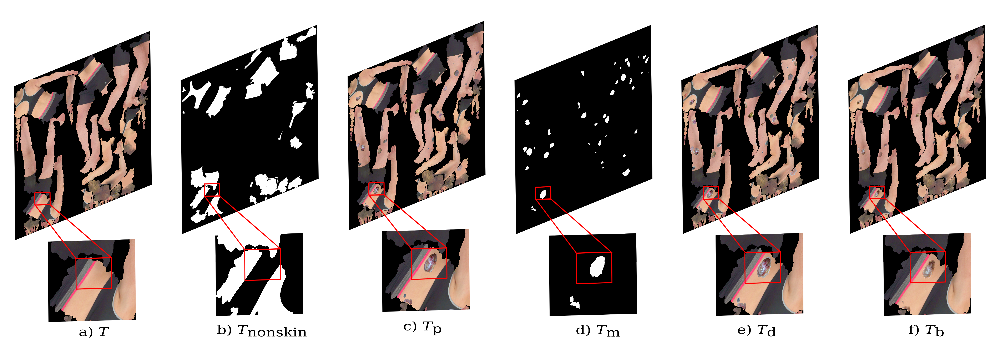
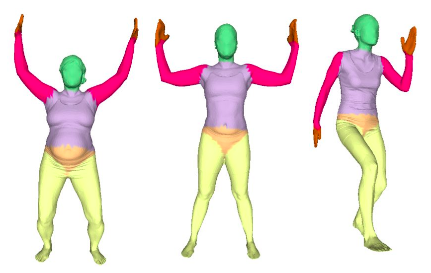

# Instructions for downloading the datasets

The datasets used in this work can be broadly categorized into data required for blending and data necessary for evaluation.

All the datasets should be downloaded and placed in the `data` directory. 

The directory structure of `data` should be as follows:
<a name="tree"></a>
```bash
DermSynth3D_private/
┣ ...						   		# other source code
┣ data/                        		# directory to store the data
┃  ┣ 3dbodytex-1.1-highres   		# data for 3DBodyTex.v1 3d models and texture maps
┃  ┣ fitzpatrick17k/
┃  ┃  ┣ data/               		# Fitzpatrick17k images
┃  ┃  ┗ annotations/        		# annotations for Fitzpatrick17k lesions
┃  ┣ ph2/                   
┃  ┃  ┣ images/               		# PH2 images
┃  ┃  ┗ labels/               		# PH2 annotations
┃  ┣ dermofit/ 						# Dermofit dataset
┃  ┃  ┣ images/               		# Dermofit images	
┃  ┃  ┗ targets/               		# Dermofit annotations 
┃  ┣ FUSeg/
┃  ┃  ┣ train/               		# training set with images/labels for FUSeg
┃  ┃  ┣ validation/               	# val set with images/labels for FUSeg
┃  ┃  ┗ test/               		# test set with images/labels for FUSeg
┃  ┣ Pratheepan_Dataset/
┃  ┃  ┣ FacePhoto/               	# images from Pratheepan dataset
┃  ┃  ┗ GroundT_FacePhoto/  	 	# annotations
┃  ┣ lesions/                   	# keep the non-skin masks for 3DBodyTex.v1 meshes here
┃  ┣ annotations/                   # segmentation masks for Annotated Fitzpatrick17k lesions
┃  ┣ bodytex_anatomy_labels/ 		# per-vertex labels for anatomy of 3DBodyTex.v1 meshes
┃  ┣ background/               		# keep the background scenes for rendering here
┃  ┗ synth_data/			   		# the generated synthetic data will be stored here
    	┣ train/               		# training set with images/labels for training on synthetic data
	    ┣ <val/test>/ 			 	# val and test set with images/labels for training on synthetic data
```
<details>

<summary> Data For Blending </summary>
<!-- ## Data For Blending  -->

### Download 3DBodyTex.v1 meshes

</img> 
<!--  -->
The `3DBodyTex.v1` dataset can be downloaded from [here](https://cvi2.uni.lu/datasets/).

`3DBodyTex.v1` contains the meshes and texture images used in this work and can be downloaded from the external site linked above (after accepting a license agreement). 

**NOTE**: These textured meshes are needed to run the code to generate the data.

We provide the non-skin texture maps annotations for 2 meshes: `006-f-run` and `221-m-u`. 
Hence, to generate the data, make sure to get the `.obj` files for these two meshes and place them in `data/3dbodytex-1.1-highres` before excecuting `scripts/gen_data.py`.

After accepting the licence, download and unzip the data in `./data/`.

---

### Download the 3DBodyTex.v1 annotations

| _Non-skin texture maps_| _Anatomy labels_|
|:-:|:-:|
|<p align=left> We provide the non-skin texture map ($T_{nonskin}$) annotations for 215 meshes from the `3DBodyTex.v1` dataset [here](https://vault.sfu.ca/index.php/s/s8Sy7JdA74r1GN9). </p> | <p align=left> We provide the per-vertex labels for anatomical parts of the 3DBodyTex.v1 meshes obtained by fitting SCAPE template body model [here](https://vault.sfu.ca/index.php/s/TLLqxCs7MVhS117). </p>|
|||

<!-- ||  --> 
<!-- 
#### *Non-skin texture maps*


We provide the non-skin texture map ($T_{nonskin}$) annotations for 215 meshes from the `3DBodyTex.v1` dataset [here](https://vault.sfu.ca/index.php/s/s8Sy7JdA74r1GN9).

#### *Anatomy labels*
 -->

<!--  -->

<!-- We provide the per-vertex labels for anatomical parts of the 3DBodyTex.v1 meshes obtained by fitting SCAPE template body model [here](https://vault.sfu.ca/index.php/s/TLLqxCs7MVhS117). -->

The folders are organised with the same IDs as the meshes in `3DBodyTex.v1` dataset.

---
<!-- <image-crop src="assets/final.png" ></image-crop> -->

### Download the Fitzpatrick17k dataset
| _Fitzpatrick17k Images_| _Fitzpatrick17k annotations_|
|:-:|:-:|
| | |
|<p align=left> We used the skin conditions from [Fitzpatrick17k](https://github.com/mattgroh/fitzpatrick17k). See their instructions to get access to the Fitzpatrick17k images. <br>We provide the raw images for the Fitzpatrick17k dataset [here](https://vault.sfu.ca/index.php/s/cMuxZNzk6UUHNmX).<br>After downloading the dataset, unzip the dataset:<br>```unzip fitzpatrick17k.zip -d data/fitzpatrick17k/```</p>| <p align=left> We provide the densely annotated lesion masks from the Fitzpatrick17k dataset are given within this repository under the `data` directory. More of such annotations can be downloaded from [here](https://vault.sfu.ca/index.php/s/gemdbCeoZXoCqlS).</p>| <p align=left> We provide the densely annotated lesion masks from the Fitzpatrick17k dataset are given within this repository under the `data` directory. More of such annotations can be downloaded from [here](https://vault.sfu.ca/index.php/s/gemdbCeoZXoCqlS). </p>|
<!--  -->
<!--  -->

<!-- We used the skin conditions from [Fitzpatrick17k](https://github.com/mattgroh/fitzpatrick17k). See instructions to get access to the Fitzpatrick17k images.

We provide the raw images for the Fitzpatrick17k dataset [here](https://vault.sfu.ca/index.php/s/cMuxZNzk6UUHNmX).
After downloading the dataset, unzip the dataset:
```
unzip fitzpatrick17k.zip -d data/fitzpatrick17k/
```


### Download the Fitzpatrick17k annotations

The densely annotated lesion masks from the Fitzpatrick17k dataset are given within this repository under the `data` directory.
More of such annotations can be downloaded from [here](https://vault.sfu.ca/index.php/s/gemdbCeoZXoCqlS). -->
---

### Download the Background Scenes

|||
|:-:|:-:|
|||

Although you can use any scenes as background for generating the random views of the lesioned-meshes, we used [SceneNet RGB-D](https://robotvault.bitbucket.io/scenenet-rgbd.html) for the background IndoorScenes. Specifically, we used [this split](https://www.doc.ic.ac.uk/~bjm113/scenenet_data/train_split/train_0.tar.gz), and sampled 3000 images from it.

For convenience, the background scenes we used to generate the ssynthetic dataset can be downloaded from [here](https://vault.sfu.ca/index.php/s/r7nc1QHKwgW2FDk).

</details>

---
<details>

<summary> Data For Training </summary>

### Download the FUSeg dataset

|||
|:-:|:-:|
|||

The Foot Ulcer Segmentation Challenge (FUSeg) dataset is available to download from [their official repository](https://github.com/uwm-bigdata/wound-segmentation/tree/master/data/Foot%20Ulcer%20Segmentation%20Challenge). 
Download and unpack the dataset at `data/FUSeg/`, maintaining the Folder Structure shown above.

For simplicity, we mirror the FUSeg dataset [here](https://vault.sfu.ca/index.php/s/2mb8kZg8wOltptT).

 ---

### Download the Pratheepan dataset


The Pratheepan dataset is available to download from [their official website](https://web.fsktm.um.edu.my/~cschan/downloads_skin_dataset.html). 
The images and the corresponding ground truth masks are available in a ZIP file hosted on Google Drive. Download and unpack the dataset at `data/Pratheepan_Dataset/`.

---

### Download the PH2 dataset


The PH2 dataset can be downloaded from [the official ADDI Project website](https://www.fc.up.pt/addi/ph2%20database.html). 
Download and unpack the dataset at `data/ph2/`, maintaining the Folder Structure shown below.

---

### Download the DermoFit dataset


_An example image from the DermoFit dataset showing different skin lesions._

The DermoFit dataset is available through a paid perpetual academic license from the University of Edinburgh. Please access the dataset following the instructions for [the DermoFit Image Library](https://licensing.edinburgh-innovations.ed.ac.uk/product/dermofit-image-library) and unpack it at `data/dermofit/`, maintaining the Folder Structure shown above.

---

### Creating the Synthetic dataset


For convenience, we provide the generated synthetic data we used in this work for various downstream tasks [here](https://vault.sfu.ca/index.php/s/mF2NVawbvvbW9lU).

If you want to train your models on a different split of the synthetic data, you can download a dataset generated by blending lesions on 26 3DBodyTex scans from [here](https://vault.sfu.ca/index.php/s/rBTjTRaxTLrnqiE).
To prepare the synthetic dataset for training. Sample the `images`, and `targets` from the path where you saved this dataset and then organise them into `train/val`.

Alternatively, you can use the code provided in `scripts/prep_data.py` to create it.

Even better, you can generate your own dataset, by following the instructions [here](./README.md#generating-synthetic-dataset).

</details>
