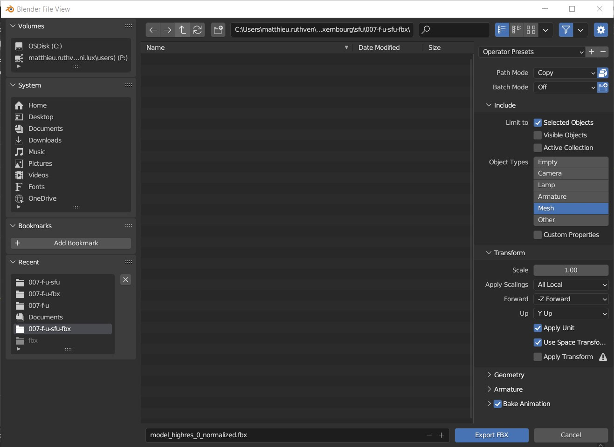
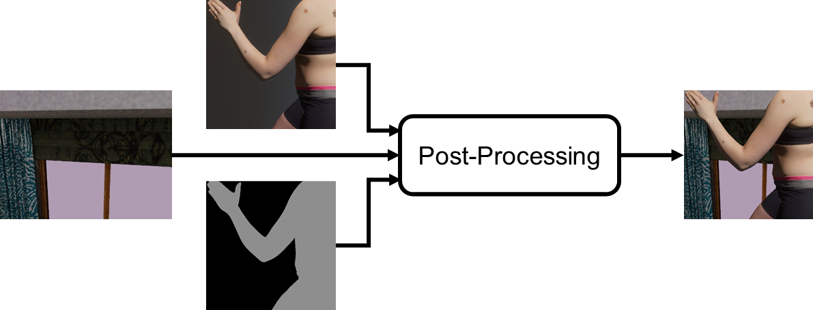

# DermSynth3D Physically Based Rendering (PBR) Using Unity

## Summary

This document explains how to create photorealistic renders using  DermSynth3D but with [Unity](https://unity.com/) instead of [PyTorch3D](https://pytorch3d.org/).

## Overview

The render creation process consists of four main steps:

1. **Raw data processing**: in this step, a Python script (*process_raw_data.py*) is used to extract the information required to create renders from the raw data and then arrange and save the information in a way that facilitates the render creation process using [Unity](https://unity.com/).
2. **FBX file creation**: in this step, [Blender](https://www.blender.org/) is used to create FBX files of the modified 3DBodyTex scans (i.e. 3DBodyTex meshes with modified texture maps), to facilitate scan import into Unity.
3. **Render creation**: in this step, [Unity](https://unity.com/) is used to create renders of the modified 3DBodyTex scans.
4. **Render post-processing**: in this step, a Python script (`add_2d_bkg_to_unity_renders.py`) is used to add backgrounds to the renders created in step 3.

## Software Dependencies

| Name | Why Required |
| --- | --- |
| [Blender](https://www.blender.org/) | To convert [3DBodyTex](https://cvi2.uni.lu/3dbodytexv1/) scan OBJ files into FBX files, to facilitate import of scans into [Unity](https://unity.com/) |
| [Unity](https://unity.com/) | To create renders |
| [Python](https://www.python.org/) | To process raw data and post-process renders created using [Unity](https://unity.com/) |
<!-- Unity [perception package](https://github.com/Unity-Technologies/com.unity.perception) | 
| The C# scripts *MoveCamera.cs* and *MoveLight.cs* |  -->

## Data

Follow the instructions in [datasets](./dataset.md) to download the [3DBodyTex](https://cvi2.uni.lu/3dbodytexv1/) scans (OBJ and MTL files) required to create renders. 

In addition, follow the instructions in [usage](../README.md#generating-synthetic-dataset) to generate the synthetic data and metadata using DermSynth3D pipeline.

The (sub)folder in [`./data`](./dataset.md) should look like below:
<!-- 
all the files stored in the *unity* folder in the [DermSynth3D](https://github.com/jeremykawahara/DermSynth3D_private) GitHub repository are required. -->
<!-- 
### 3DBodyTex Scans

| Column 1       | Column 2       | Column 3       |
| ---            | ---            | ---            |
| 008-f-run      | 136-f-a        | 232-m-scape010 |
| 015-f-run      | 146-f-a        | 234-m-scape070 |
| 024-f-scape046 | 182-f-a        | 238-m-scape059 |
| 041-f-u        | 172-f-a        | 239-m-u        |
| 053-f-u        | 174-f-a        | 247-m-u        |
| 055-f-u        | 186-f-a        | 270-m-scape048 |
| 059-f-u        | 200-m-run      | 352-m-a        |
| 089-f-scape015 | 210-m-run      | 355-m-scape038 |
| 134-f-a        | 214-m-run      |                | -->

<!-- ###  Software -->


## Raw Data

<!-- The raw data is listed in the table below.

| Raw Data | File Type | Folder Containing Data |
| --- | --- | --- |
| Modified texture maps for 26 [3DBodyTex](https://cvi2.uni.lu/3dbodytexv1/) scans | PNG | *bodytex_masks* |
| Lists of lighting and camera position and orientation used to create renders of [3DBodyTex](https://cvi2.uni.lu/3dbodytexv1/) scans | CSV | *render_meta_data* |
| Lists of unique IDs of the background added to each render | CSV | *render_meta_data* |
| Lists of unique IDs of each render | CSV | *render_meta_data* |
| Images of backgrounds to add to renders in post-processing step | JPG | *IndoorScene* |

The raw data and processed raw data are contained in the [DermSynth3D](https://github.com/jeremykawahara/DermSynth3D_private) GitHub repository, in folders and files with the following structure and naming convention: -->
```
    DermSynth3D_private/
    └── data/
        ├── blended_lesions         # the 'save_dir` key in configs/blend.yaml
       │   │   ├── gen_008/        # folder containing images, targets and metadata 
       │   │   │   └── data.csv
       │   │   ├── ...
       │   │   └── gen_355/
       │   │       └── data.csv
       │   ├── 3dbodytex_dataset/     # folder containing the meshes, texture maps, and texture masks
       │   │   ├── 355-m-scape039/
       │   │   │   ├── model_highres_0_normalized_debug.png
       │   │   │   └── model_highres_0_normalized_mask.png
       │   │   ├── ...
       │   └── processed_raw_data/  # folder containing the processed renders
       │       ├── 0.jpg
       │       ├── ...
       │       └── 7475.jpg
       └── processed_raw_data/      # folder containing the metadata for unity and texture maps after pre-processing
            ├── 008-f-run-blended/
            │   ├── all_params.csv
            │   └── model_highres_0_normalized.png
            ├── ...
```
## Pre-Processing of metadata

### Step 1: Change camera co-ordinate system

Once you have a folder structure that resembles the one above, run the script `process_raw_data.py` to:
- read the raw data CSV files
- extract and save the information as CSV files in a format that is easier for [Unity](https://unity.com/) to read.
  
More specifically, the script extracts the following information:
<!-- ### Requirements

- The CSV files of raw data
- The modified texture maps for the [3DBodyTex](https://cvi2.uni.lu/3dbodytexv1/) scans
- [Python](https://www.python.org/)
- The Python script *process_raw_data.py* -->

<!-- ### Instructions

The Python -->
 
1. The location (x-, y- and z-coordinates) of the point light in each scene, and the x-, y- and z-coordinates of the point which the light is focused on
2. The location (x-, y- and z-coordinates) of the camera in each scene, and the x-, y- and z-coordinates of the point which the camera is focused on
3. The ID of the background that should be added to each render

**Note** that all the coordinates are in the [PyTorch3D](https://pytorch3d.org/) coordinate system which is different to that of [Unity](https://unity.com/).

The script assumes that folders and files have the structure and naming convention shown in the *Raw Data* section above. 
It creates a new folder for each modified 3DBodyTex scan and saves the CSV file of extracted information and a renamed copy of the modified texture map in this folder.
The texture map is renamed so that the [3DBodyTex](https://cvi2.uni.lu/3dbodytexv1/) scan OBJ, MTL and modified texture map all have the same name. 
All the folders, CSV files and modified texture maps created by the script are stored in the *processed_raw_data* folder
 <!-- in the [DermSynth3D](https://github.com/jeremykawahara/DermSynth3D_private) GitHub repository. -->

### Step 2: FBX File Creation

The [3DBodyTex](https://cvi2.uni.lu/3dbodytexv1/) scan meshes are OBJ files.
However, import of such files into [Unity](https://unity.com/) is more error-prone than import of FBX files.
Converting the [3DBodyTex](https://cvi2.uni.lu/3dbodytexv1/) scans into FBX files is therefore desirable and achieved using [Blender](https://www.blender.org/).

<!-- ### Requirements

- The [3DBodyTex](https://cvi2.uni.lu/3dbodytexv1/) scans OBJ and MTL files
- The modified texture maps for the scans
- [Blender](https://www.blender.org/) -->

<!-- ### Instructions -->
In order to convert the `.obj` scans to `.fbx`:

1. Copy the OBJ and MTL files of each [3DBodyTex](https://cvi2.uni.lu/3dbodytexv1/) scan to the corresponding folder created during the raw data processing. For example, copy the OBJ and MTL files of [3DBodyTex](https://cvi2.uni.lu/3dbodytexv1/) scan *008-f-run* to the *008-f-run* folder.
2. Import the OBJ file into [Blender](https://www.blender.org/).
3. Export the scan as an FBX file, ensuring the correct export settings (see Figure below) are selected.



For more information about converting OBJ files to FBX files using [Blender](https://www.blender.org/), see [this](https://www.youtube.com/watch?v=jZWSHBEOaR0&ab_channel=RichTanner) video.


### Step 3: Render Creation

The Unity [perception package](https://github.com/Unity-Technologies/com.unity.perception) creates binary masks showing where the scans are in the renders.
These binary masks are required to add backgrounds to the renders.

#### Dependencies

- Unity [perception package](https://github.com/Unity-Technologies/com.unity.perception)
- The C# scripts *MoveCamera.cs* and *MoveLight.cs* 

#### Instructions

1. Complete steps 1 and 2 of [this](https://github.com/Unity-Technologies/com.unity.perception/blob/main/com.unity.perception/Documentation%7E/Tutorial/Phase1.md) tutorial to set up a new project in [Unity](https://unity.com/) and download the Unity [perception package](https://github.com/Unity-Technologies/com.unity.perception).
2. Create an empty scene in [Unity](https://unity.com/).
3. Add a camera and a light to the scene.
4. Add a Perception Camera component to the camera. See step 3 of the tutorial above for more information on how to do this.
5. Modify the Scheduled Capture properties of the camera to:
    - Simulation Delta Time: 0.01
    - Start at Frame: 99
    - Frames Between Captures: 99
6. Change the camera Field of View to 30 and its Near Clipping Plane to 0.01.
7. Change the output image matrix size to 512x512 pixels (Game View>>Free Aspect>>+).
8. Change the folder where renders will be saved (Edit>>Project Settings>>Perception>>Solo Endpoint>>Base Path).
9. Add the C# scripts *MoveCamera.cs* and *MoveLight.cs* to the Assets folder in [Unity](https://unity.com/).
10. Add *MoveCamera.cs* to the camera you added to the scene in step 3.
11. Add *MoveLight.cs* to the light you added to the scene in step 3.
12. Add a folder containing a modified 3DBodyTex scan FBX file to the Assets folder.
13. Open the newly added folder and add the *model_highres_0_normalized* FBX file to the scene.
14. Set up the ground-truth label for the FBX file. See step 4 of the tutorial above for more information on how to do this.
15. Add the *all_params.csv* file from the folder added to the Assets folder in step 12 to the MoveCamera component of the camera and the MoveLight component of the light.
16. Click on the play button to run the simulation, and then press on the play button again to stop the simulation when all renders have been created. Renders and binary masks showing where the scans are in the renders will be saved in the folder specified in step 8.
17. Delete the *model_highres_0_normalized* FBX file in the scene.
18. Delete the folder added to the Assets folder in step 12.
19. Repeat steps 12 to 18 (except step 15) for another folder containing a modified 3DBodyTex scan FBX file.

For detailed instructions on how to set up the Unity [perception package](https://github.com/Unity-Technologies/com.unity.perception), see [this](https://www.youtube.com/watch?v=mkVE2Yhe454&ab_channel=TheSecretsofApagayoIsland) video.

*MoveCamera.cs* and *MoveLight.cs* read the coordinates in the CSV files of extracted information and move the camera and light to these coordinates.

## Post-Processing of the Renderings

After the pre-processing of raw data is completeed, we are now ready to create the renderings using Unity with the background scene same as that in`raw metadata`.
<!-- ### Requirements

- Renders and binary masks created using [Unity](https://unity.com/) and the Unity [perception package](https://github.com/Unity-Technologies/com.unity.perception)
- The images of backgrounds and CSV files of raw data
- The CSV files of extracted information
- [Python](https://www.python.org/)
- The Python script *add_2d_bkg_to_unity_renders.py* -->

<!-- ### Instructions -->

Consequently, run the python script `add_2d_bkg_to_unity_renders.py` to combine the background images and the renders and binary masks created using [Unity](https://unity.com/) and the Unity [perception package](https://github.com/Unity-Technologies/com.unity.perception), and then save the resulting images as PNG files.
The Figure below shows an overview of this process.



The script assumes that folders and files have the structure and naming convention shown below. It creates two new folders (*renders* and *masks*) in each modified 3DBodyTex scan folder (e.g. *008-f-run-blended* in the Figure below) and saves the post-processed images as PNG files in renders and renamed copies of the binary masks in *masks*. The name of each post-processed image is the unique ID listed in the corresponding CSV file of raw data. 
<!-- 
    unity/
    ├── add_2d_bkg_to_unity_renders.py
    ├── raw_data/
    ├── processed_raw_data/
    └── unity_renders/
        ├── 008-f-run-bended/
        │   └── solo/
        │       └── sequence.0/
        │           ├── step0.camera.png
        │           ├── step0.camera.semantic segmentation.png
        │           ├── ...
        │           ├── stepN.camera.png
        │           └── stepN.camera.semantic segmentation.png
        ├── ...
        └── 355-m-scape039-pasted/
            └── solo/
                └── sequence.0/
                    ├── step0.camera.png
                    ├── step0.camera.semantic segmentation.png
                    ├── ...
                    ├── stepN.camera.png
                    └── stepN.camera.semantic segmentation.png
``` -->